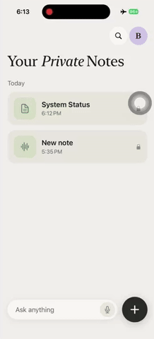

<div align="center">

# 🧠 Awesome On-Device AI Apps

### Ship the AI features the cloud legally can't. 36 apps that run 100% on the phone.

   

**No compliance wall&nbsp; ·&nbsp; $0 at any scale&nbsp; ·&nbsp; Data never leaves the device&nbsp; ·&nbsp; Works offline**

<sub>💬 Chat&nbsp; · &nbsp;🌐 Translate&nbsp; · &nbsp;👁️ Vision&nbsp; · &nbsp;❤️ Health&nbsp; · &nbsp;🎙️ Voice&nbsp; · &nbsp;📈 Forecasting</sub>

<br/>

[](https://github.com/zetic-ai/awesome-on-device-ai-apps/stargazers)
[](https://github.com/zetic-ai/awesome-on-device-ai-apps/network/members)
[](https://github.com/zetic-ai/awesome-on-device-ai-apps/commits)
[](LICENSE)

[](.)
[](CONTRIBUTING.md)
[](https://discord.gg/gqhDWfZbgU)

<sub>⚡ Powered by <a href="https://mlange.zetic.ai"><b>Melange</b></a>, the on-device NPU runtime</sub>

</div>

<br/>

> ### On-device is a business decision, not just a technical one.

Every app here runs the model on the phone itself. Nothing goes to a server. That one fact rewrites the economics:

- 🛡️ **No compliance wall.** No user data in the cloud means no GDPR, HIPAA, or data-residency blocker between you and launch. Put AI into health, finance, and enterprise products, and actually charge for it.
- 💸 **$0 marginal cost.** No per-token bill, no inference servers. Your margins hold as you scale from 1 to 10 million users.
- 🔒 **Private by design.** Nothing leaves the device, so there is no cloud dataset to breach, leak, or get audited over.
- ⚡ **Instant and offline.** Runs on the phone's NPU with no network round-trip, on a plane, a subway, or a factory floor with no signal.

And these are not snippets. Every folder is a finished app you clone and run on a real device today.

<br/>

## ⚡ Run one on your phone

Pick any app, clone, and run it on a real device. No ML setup, no model conversion, no C++.

```bash
git clone https://github.com/zetic-ai/awesome-on-device-ai-apps.git
cd awesome-on-device-ai-apps

# A free key lets the app pull its NPU-optimized weights on first launch
# (30 seconds, no card): mlange.zetic.ai -> Settings -> Personal Access Token
./scripts/adapt_mlange_key.sh

# Open an app on a REAL device (the NPU isn't in the simulator):
#   Android:  apps/<AppName>/Android    in Android Studio
#   iOS:      apps/<AppName>/iOS        in Xcode
#   Flutter:  cd apps/<AppName>/Flutter && flutter run
```

<br/>

## 🗂️ The apps

> Auto-generated from each app's `meta.json`. Run `python3 scripts/generate_catalog.py` after adding one.

<!-- CATALOG:START -->

**Jump to:** 💬 [Language & Text](#cat-language-text) · 👁️ [Vision](#cat-vision) · ❤️ [Health & Wellbeing](#cat-health-wellbeing) · 🔊 [Audio](#cat-audio) · 📈 [Forecasting](#cat-forecasting)

<a id="cat-language-text"></a>

### 💬 Language & Text

| App | What it does | Model | Platforms | Try it |
| :-- | :-- | :-- | :-- | :-- |
| [**Brew AI Notes**](apps/Brew-AI-Notes) | Records, transcribes & summarizes meetings, then lets you ask anything. Granola, but fully private. | `Gemma-4-E2B` | `iOS` | [Model ↗](https://mlange.zetic.ai/p/changgeun/gemma-4-E2B-it) |
| [**CherryPad**](apps/AI-Keyboard) | An AI keyboard that rewrites, replies, translates, and fixes grammar, all on-device. No text ever leaves the phone. | `LFM2.5-350M` | `Android` `iOS` | [Model ↗](https://mlange.zetic.ai/p/Steve/LFM2.5_350M) |
| [**Grammar Fixer**](apps/t5_base_grammar_correction) | Real-time grammar correction as you type | `T5-base` | `Android` `iOS` | [Model ↗](https://mlange.zetic.ai/p/Team_ZETIC/t5-base-grammar-correction) |
| [**HY-MT Translator**](apps/tencent_HY-MT) | Streaming offline machine translation with instant language swap | `Tencent HY-MT` | `Android` `iOS` | [Model ↗](https://mlange.zetic.ai/p/vaibhav-zetic/tencent_HY-MT) |
| [**MedASR**](apps/MedASR) | Medical-domain speech recognition, fully on-device. | `MedASR` | `Android` | [Model ↗](https://mlange.zetic.ai/p/vaibhav-zetic/Medasr) |
| [**Offline Translator**](apps/translate-tencent_HY-MT) | Translate by text, voice, or camera/OCR, with real-time streaming and instant language swap | `Tencent HY-MT` | `Android` `iOS` | [Model ↗](https://mlange.zetic.ai/p/vaibhav-zetic/tencent_HY-MT) |
| [**PromptGuard**](apps/PromptGuard) | Flags prompt-injection and jailbreak text as benign or malicious, on-device via CoreML. | `Llama Prompt Guard 2` | `iOS` | [Model ↗](https://mlange.zetic.ai/p/jathin-zetic/llama_prompt_guard_2) |
| [**Qwen3 Chat**](apps/Qwen3Chat) | A private ChatGPT in your pocket, with real-time token streaming | `Qwen3-4B` | `Android` `iOS` | [Model ↗](https://mlange.zetic.ai/p/Qwen/Qwen3-4B) |
| [**SayRight**](apps/PronunciationScoring) | Reads a sentence aloud and scores your pronunciation per word and per phoneme, fully offline. | `Citrinet-256 (phoneme CTC)` | `Flutter` | [Model ↗](https://mlange.zetic.ai/p/ajayshah/PronunciationScoring) |
| [**Text Anonymizer**](apps/TextAnonymizer) | Auto-detects & masks PII (names, emails, phones) before any data moves | `tanaos-anonymizer-v1` | `Android` `iOS` | [Model ↗](https://mlange.zetic.ai/p/Steve/text-anonymizer-v1) |
| [**VoxScribe**](apps/VoxScribe) | Transcribes speech and labels who spoke, fully offline. | `pyannote + Whisper` | `Flutter` | [Model ↗](https://mlange.zetic.ai/p/ajayshah/VoxScribe-whisper-decoder) |
| [**Whisper ASR**](apps/whisper-tiny) | High-accuracy speech-to-text, fully offline | `Whisper Tiny` | `Android` `iOS` | [Model ↗](https://mlange.zetic.ai/p/OpenAI/whisper-tiny-decoder) |

<a id="cat-vision"></a>

### 👁️ Vision

| App | What it does | Model | Platforms | Try it |
| :-- | :-- | :-- | :-- | :-- |
| [**Emotion Recognition**](apps/FaceEmotionRecognition) | Real-time facial emotion from the camera | `Emo-AffectNet` | `Android` `iOS` | [Model ↗](https://mlange.zetic.ai/p/ElenaRyumina/FaceEmotionRecognition) |
| [**Face Detection**](apps/MediaPipe-Face-Detection) | Ultra-fast selfie-range face detection | `BlazeFace` | `Android` `iOS` | [Model ↗](https://mlange.zetic.ai/p/google/MediaPipe-Face-Detection) |
| [**Face Landmarker**](apps/MediaPipe-Face-Landmarker) | 468-point face mesh tracking | `MediaPipe` | `Android` `iOS` | [Model ↗](https://mlange.zetic.ai/p/google/MediaPipe-Face-Landmark) |
| [**GlyphGo**](apps/SignTranslate) | Point your camera at a sign or menu and read the text live, fully offline. Built for travelers with no signal. | `PP-OCRv5 (DBNet + SVTR)` | `Flutter` | [Model ↗](https://mlange.zetic.ai/p/ajayshah/SignTranslate_Detect) |
| [**PlateHawk**](apps/VehiclePlateYOLO) | Detects license plates in the live camera feed, frame by frame, entirely on-device. | `YOLOv8n` | `Flutter` | [Model ↗](https://mlange.zetic.ai/p/ajayshah/VehiclePlateYOLO) |
| [**RedactLens**](apps/LiveDocRedact) | Auto-redacts name, date-of-birth, and ID fields on IDs and forms live in the camera preview, before anything is stored. | `PP-OCRv5 (DBNet + CRNN)` | `Flutter` | [Model ↗](https://mlange.zetic.ai/p/ajayshah/LiveDocRedact_Detect) |
| [**ShelfSense**](apps/ShelfScanYOLO) | Counts and boxes every product facing on a dense retail-shelf photo, on-device. | `YOLO11s (SKU-110K)` | `Flutter` | [Model ↗](https://mlange.zetic.ai/p/ajayshah/ShelfScanYOLO) |
| [**SiteGuard**](apps/SafetyPPEYOLO) | Real-time worker PPE compliance: detects helmets, vests, and violations live on the camera feed. | `YOLOv8s (PPE)` | `Flutter` | [Model ↗](https://mlange.zetic.ai/p/ajayshah/SafetyPPEYOLO) |
| [**SkyScout**](apps/AerialDetectYOLO) | Real-time aerial and drone object detection across 10 VisDrone classes, live on-device. | `YOLOv8s (VisDrone)` | `Flutter` | [Model ↗](https://mlange.zetic.ai/p/ajayshah/AerialDetectYOLO) |
| [**YOLO26**](apps/YOLO26) | Next-gen NMS-free object detection | `YOLO26` | `Android` `iOS` | [Model ↗](https://mlange.zetic.ai/p/Team_ZETIC/YOLO26) |
| [**YOLOv26-Seg**](apps/Ultralytics_YOLOv26-Seg-Nano) | Real-time instance segmentation on-device with YOLOv26-Seg Nano. | `YOLOv26-Seg Nano` | `Android` | [Model ↗](https://mlange.zetic.ai/p/vaibhav-zetic/Yolov26-Seg-Nano) |
| [**YOLOv8**](apps/YOLOv8) | Real-time object detection & tracking in milliseconds | `YOLOv8n` | `Android` `iOS` | [Model ↗](https://mlange.zetic.ai/p/Ultralytics/YOLOv8n) |

<a id="cat-health-wellbeing"></a>

### ❤️ Health & Wellbeing

| App | What it does | Model | Platforms | Try it |
| :-- | :-- | :-- | :-- | :-- |
| [**Camera Vitals**](apps/Camera-Vitals) | Contactless heart-rate from the front camera; frames never leave the phone | `EfficientPhys-rPPG` | `Android` `iOS` | [Model ↗](https://mlange.zetic.ai/p/realtonypark/EfficientPhys-rPPG_camera_vitals) |
| [**FundusGate**](apps/RetinaDRScreen) | Screens fundus photos for referable diabetic retinopathy, on-device (non-diagnostic). | `MobileNetV2` | `Flutter` | [Model ↗](https://mlange.zetic.ai/p/ajayshah/RetinaDRScreen) |
| [**GradeVue**](apps/RetinaDRGrade) | Grades diabetic-retinopathy severity from a fundus photo, on-device (non-diagnostic). | `MobileNetV2` | `Flutter` | [Model ↗](https://mlange.zetic.ai/p/ajayshah/RetinaDRGrade) |
| [**OraLens**](apps/DentalXrayDetect) | Detects caries and periapical lesions on a dental X-ray you upload, on-device (non-diagnostic). | `YOLO11n` | `Flutter` | [Model ↗](https://mlange.zetic.ai/p/ajayshah/DentalXRayDetect) |
| [**Skin Classifier**](apps/Skin-Image-Classification) | On-device skin-lesion classification with severity-aware guidance (non-diagnostic) | `Skin-Cancer ViT` | `Android` `iOS` | [Model ↗](https://mlange.zetic.ai/p/realtonypark/Skin_Cancer-Image_Classification) |
| [**Voice Biomarker**](apps/Voice-Biomarker) | Speech-emotion + respiratory event detection (cough, wheeze) from mic audio | `wav2vec2 · YAMNet` | `Android` `iOS` | [Model ↗](https://mlange.zetic.ai/p/realtonypark/Wav2Vec2-Base_Emotion-Recognition) |
| [**Wellbeing Screener**](apps/multimodal-screener) | Fuses live face- and voice-emotion into an explainable mood check-in | `wav2vec2 · Emo-AffectNet` | `Android` `iOS` | [Model ↗](https://mlange.zetic.ai/p/realtonypark/Wav2Vec2-Base_Emotion-Recognition) |

<a id="cat-audio"></a>

### 🔊 Audio

| App | What it does | Model | Platforms | Try it |
| :-- | :-- | :-- | :-- | :-- |
| [**NeuTTS Nano**](apps/NeuTTSNanoApp) | On-device text-to-speech with voice cloning, via a three-stage NeuTTS Nano pipeline. | `NeuTTS Nano` | `iOS` | [Model ↗](https://mlange.zetic.ai/p/jathin-zetic/neutts_nano) |
| [**Qwen TTS**](apps/QwenTextToSpeech) | On-device text-to-speech with a custom voice, running the Qwen3-TTS pipeline on the NPU. | `Qwen3-TTS-0.6B` | `iOS` | [Model ↗](https://mlange.zetic.ai/p/jathin-zetic/qwen_tts06b_talker) |
| [**YamNet**](apps/YamNet) | Classifies environmental sounds & audio events | `YAMNet` | `Android` `iOS` | [Model ↗](https://mlange.zetic.ai/p/google/Sound%20Classification%28YAMNET%29) |

<a id="cat-forecasting"></a>

### 📈 Forecasting

| App | What it does | Model | Platforms | Try it |
| :-- | :-- | :-- | :-- | :-- |
| [**Chronos Forecast**](apps/ChronosTimeSeries) | Probabilistic time-series forecasting with CSV import & interactive charts | `Chronos-Bolt` | `Android` `iOS` | [Model ↗](https://mlange.zetic.ai/p/Team_ZETIC/Chronos-balt-tiny) |
| [**SentryWave**](apps/SensorForecastTS) | Streams live sensor data, forecasts it with a quantile fan, and flags anomalies that break the band. | `Chronos-Bolt-tiny` | `Flutter` | [Model ↗](https://mlange.zetic.ai/p/ajayshah/SensorForecastTS) |

<!-- CATALOG:END -->

<br/>

## 🧩 Build your own, with Melange

Every app above runs on-device thanks to [**Melange**](https://mlange.zetic.ai), the engine that turns an AI model into a phone-ready, NPU-optimized build. Point it at your own model and you get a shipped on-device app in about an hour, not months of hardware tuning.

Dropping it into an existing project is about 3 lines:

**Android**, in `build.gradle.kts`:
```kotlin
dependencies { implementation("com.zeticai.mlange:mlange:+") }
```
```kotlin
val model = ZeticMLangeModel(context = this, tokenKey = "YOUR_KEY", modelName = "Team_ZETIC/YOLO26")
val outputs = model.run(inputs)   // NPU-accelerated, on-device
```

**iOS**, via Swift Package Manager → `https://github.com/zetic-ai/ZeticMLangeiOS.git`:
```swift
let model = try ZeticMLangeModel(tokenKey: "YOUR_KEY", name: "Team_ZETIC/YOLO26", version: 1)
let outputs = try model.run(inputs: inputs)
```

Bring your own model: upload it to [Melange](https://mlange.zetic.ai), it converts and NPU-optimizes automatically, then hands you back the code.

<br/>

## 🤝 Contribute an app

This gallery grows by contribution, and the bar is one question: **would a stranger clone this and actually use it?**

1. Drop your app in `apps/<YourApp>/` with `Android/` and/or `iOS/`
2. Add a `meta.json` (see any existing app) and a `README.md`
3. Run `python3 scripts/generate_catalog.py` to add it to the catalog
4. Prove it runs on a real device (demo GIF in the PR)

Full guide → **[CONTRIBUTING.md](CONTRIBUTING.md)**. Questions → [Discord](https://discord.gg/gqhDWfZbgU).

<br/>

## ⭐ Star history

<div align="center">

[](https://star-history.com/#zetic-ai/awesome-on-device-ai-apps&Date)

<br/>

Built by [ZETIC](https://zetic.ai) · Powered by [Melange](https://mlange.zetic.ai)

[](https://github.com/zetic-ai/awesome-on-device-ai-apps/graphs/contributors)

**If a phone-native AI app made you go _"wait, that runs offline?"_, then ⭐ star it. It's how the next dev finds it.**

</div>

<br/>

## 📄 License

App source is **Apache 2.0**: use it commercially or privately, however you like. The Melange SDK itself is a proprietary library under the ZETIC [Terms of Service](https://zetic.ai/terms).

<!-- ───────────────────────────────────────────────────────────────────────────
     MAINTAINER TODO: things that need a human; teammates please fill in.
     Kept as an HTML comment so it doesn't render on GitHub. See TODO.md for the
     tracked, checkbox version.
     ─────────────────────────────────────────────────────────────────────────── -->
