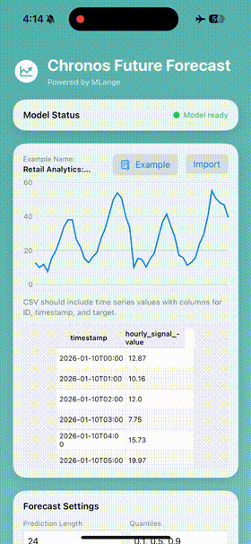

<div align="center">

# 🧠 Awesome On-Device AI Apps

### Your phone has an NPU as fast as a GPU from 2018.
### You're still calling a cloud API. **Why?**

<br/>

🤖 **20+ real AI apps that run 100% on your phone — and more landing every week.**
No cloud. No latency. No API bills. No data leaving the device.
`git clone` → builds → **runs on your phone today.**

<br/>

[](LICENSE)
[](.)
[](#-the-app-gallery)
[](.)
[](#-add-your-own-app)
[](https://discord.gg/gqhDWfZbgU)

<br/>

**⭐ Not a link farm. Not a paper list. Not "SDK examples."**
**These are complete apps you can run on a real device *today* — with more in the PR queue than in the repo.**

<br/>

| [**On-Device Chat**](apps/Qwen3Chat) | [**Offline Translator**](apps/translate-tencent_HY-MT) | [**Private AI Notes**](apps/Brew-AI-Notes) | [**Camera Heart-Rate**](apps/Camera-Vitals) |
|:---:|:---:|:---:|:---:|
|  |  |  |  |

</div>

<br/>

## 🎯 The Whole Point

Every other "on-device AI" repo hands you a **list of links** — papers, model zoos, inference engines. Cool. But then you still have to build the app.

**This repo is the opposite.** Each folder is a *finished, running app* — native Android + iOS, model already wired to the NPU. You don't read *about* on-device AI here. You **clone it and it runs.**

> ### The rule this repo lives by:
> **This must not be "SDK Examples." It must be "Something I can use *right now*."**

If an app in here feels like a toy demo instead of something you'd actually ship — [open an issue](../../issues). That's a bug.

<br/>

## ⚡ Why On-Device?

| | Cloud AI | **On-Device AI (this repo)** |
|---|:---:|:---:|
| **Latency** | 200–2000ms round-trip | ⚡ Real-time, **zero network** |
| **Privacy** | Your data → someone's server | 🔒 **Nothing leaves the phone** |
| **Cost** | $ per API call, forever | 💸 **$0 inference, forever** |
| **Offline** | ❌ Dead without signal | ✈️ **Works on airplane mode** |
| **Speed** | Depends on their GPUs | 🚀 **NPU-accelerated, native** |

The catch used to be that squeezing a model onto a phone NPU took *months* of hardware-specific tuning. That's the part [**Melange**](https://mlange.zetic.ai) automates — so these apps exist.

<br/>

## 🖼️ The App Gallery

<div align="center">

| [**Wellbeing Screener**](apps/multimodal-screener) | [**Voice Biomarker**](apps/Voice-Biomarker) | [**Skin Classifier**](apps/Skin-Image-Classification) | [**Time-Series Forecast**](apps/ChronosTimeSeries) |
|:---:|:---:|:---:|:---:|
|  |  |  |  |

</div>

<br/>

### 💬 Language & Text
| App | What it does | On-device model |
|:---|:---|:---|
| [**Qwen3 Chat**](apps/Qwen3Chat) | Full LLM chatbot with streaming tokens — a private ChatGPT in your pocket | Qwen3-4B |
| [**Brew — AI Notes**](apps/Brew-AI-Notes) | Records, transcribes & summarizes meetings, then lets you *ask anything*. Granola, but private. | Gemma-4-E2B |
| [**Offline Translator**](apps/translate-tencent_HY-MT) | Translate by text, **voice**, or **camera/OCR** — real-time, instant language swap, zero signal needed | Tencent HY-MT |
| [**Grammar Fixer**](apps/t5_base_grammar_correction) | Real-time grammar correction as you type | T5-base |
| [**Text Anonymizer**](apps/TextAnonymizer) | Auto-detects & masks PII (names, emails, phones) before data ever moves | tanaos-anonymizer-v1 |
| [**Whisper ASR**](apps/whisper-tiny) | High-accuracy speech-to-text, fully offline | Whisper Tiny |

### 👁️ Vision
| App | What it does | On-device model |
|:---|:---|:---|
| [**YOLO26**](apps/YOLO26) | Next-gen NMS-free object detection | YOLO26 |
| [**YOLOv8**](apps/YOLOv8) | Real-time object detection & tracking in milliseconds | YOLOv8n |
| [**Face Landmarker**](apps/MediaPipe-Face-Landmarker) | 468-point face mesh tracking | MediaPipe |
| [**Face Detection**](apps/MediaPipe-Face-Detection) | Ultra-fast selfie-range face detection | BlazeFace |
| [**Emotion Recognition**](apps/FaceEmotionRecognition) | Real-time facial emotion from the camera | Emo-AffectNet |

### ❤️ Health & Wellbeing
| App | What it does | On-device model |
|:---|:---|:---|
| [**Camera Vitals**](apps/Camera-Vitals) | Contactless **heart-rate** from the front camera — frames never leave the phone | EfficientPhys-rPPG |
| [**Voice Biomarker**](apps/Voice-Biomarker) | Speech-emotion + respiratory event detection (cough, wheeze) from mic audio | wav2vec2 · YAMNet |
| [**Skin Classifier**](apps/Skin-Image-Classification) | On-device skin-lesion classification with severity-aware guidance (non-diagnostic) | Skin-Cancer ViT |
| [**Wellbeing Screener**](apps/multimodal-screener) | Fuses live face- and voice-emotion into an explainable mood check-in | wav2vec2 · Emo-AffectNet |

### 🔊 Audio & 📈 Data
| App | What it does | On-device model |
|:---|:---|:---|
| [**YamNet**](apps/YamNet) | Classifies environmental sounds & audio events | YAMNet |
| [**Chronos Forecast**](apps/ChronosTimeSeries) | Probabilistic time-series forecasting with CSV import & charts | Chronos-Bolt |

> **20+ apps live, and the list grows every week.** Every one is native Android and/or iOS, with the model already running on the NPU. New apps land as fast as we can ship them — [watch the repo](../../watchers) to catch them.

<br/>

## 🚀 Ship One in an Hour

```bash
# 1. Clone
git clone https://github.com/zetic-ai/awesome-on-device-ai-apps.git
cd awesome-on-device-ai-apps

# 2. Get a free key — the NPU engine needs it (30 seconds, no credit card)
#    → https://mlange.zetic.ai  →  Settings  →  Personal Access Token

# 3. Wire it in automatically
./adapt_mlange_key.sh

# 4. Pick an app and open it
#    Android →  apps/<AppName>/Android   in Android Studio
#    iOS     →  apps/<AppName>/iOS       in Xcode
#    Run on a REAL device (the NPU isn't in the simulator)
```

That's it. No model conversion, no C++, no hardware SDK spelunking. Pick a folder, hit Run.

> 💡 **Why the key?** The apps ship the app code; the free Melange token streams the NPU-optimized model weights to your device on first launch. Inference itself is 100% local afterward.

<br/>

## 🔧 Drop On-Device AI Into *Your* App

Like what you see and want it in your own project? It's ~3 lines.

**Android** — `build.gradle.kts`:
```kotlin
dependencies { implementation("com.zeticai.mlange:mlange:+") }
```
```kotlin
val model = ZeticMLangeModel(context = this, tokenKey = "YOUR_KEY", modelName = "Team_ZETIC/YOLO26")
val outputs = model.run(inputs)   // NPU-accelerated inference
```

**iOS** — Swift Package Manager → `https://github.com/zetic-ai/ZeticMLangeiOS.git`:
```swift
let model = try ZeticMLangeModel(tokenKey: "YOUR_KEY", name: "Team_ZETIC/YOLO26", version: 1)
let outputs = try model.run(inputs: inputs)
```

Want your *own* model on-device? Upload it to [Melange](https://mlange.zetic.ai), it converts & NPU-optimizes automatically, and you get code back.

<br/>

## 🔥 Landing This Week

These are in the PR queue *right now* — real apps, being merged as you read this:

- 🦺 **SiteGuard** — on-device worker PPE detection (helmet + vest + violations)
- 🚗 **PlateHawk** — license-plate detection + on-device OCR
- 👁️ **FundusGate** / **GradeVue** — diabetic-retinopathy screening & severity grading
- 🦷 **OraLens** — dental X-ray anomaly detection
- 🛒 **ShelfSense** — retail-shelf SKU detection
- 🗣️ **SayRight** — phoneme-CTC pronunciation scoring
- ⌨️ **CherryPad** — a fully on-device AI keyboard
- 🎙️ **VoxScribe** — speaker-labeled offline transcription
- 🔊 **TTS wave** — Qwen3-TTS custom voice, neutts-nano, pocket-tts
- 🩺 **MedASR / MedGemma** — medical speech recognition & multimodal QA

…plus aerial detection, scene-text reading, live PII redaction, and more. **The queue is deeper than the repo — and that's the point.** [Watch the repo](../../watchers) or [add yours →](#-add-your-own-app)

<br/>

## 🤝 Add Your Own App

This gallery grows by contribution. If you built something that runs on-device and someone would actually *use* it — send it.

1. **Fork** & branch (`git checkout -b feature/my-app`)
2. **Build it** on a [pre-optimized model](https://mlange.zetic.ai), or upload your own and let Melange convert it
3. **Match the folder shape** — `Android/`, `iOS/`, `README.md`, ideally both platforms
4. **Prove it runs on a real device** (screenshots or a demo GIF in the PR)
5. **Add a row** to the gallery table above
6. **Open the PR** 🎉

The bar for merging: *would a stranger clone this and use it?* If yes, we want it.

**Need a hand?** [Discord](https://discord.gg/gqhDWfZbgU) · [Issues](../../issues) · [Docs](https://docs.zetic.ai)

<br/>

## 📄 License

App source code is **Apache 2.0** — use it commercially, privately, however. The Melange SDK itself is a proprietary library under the ZETIC [Terms of Service](https://zetic.ai/terms). Keep the license & copyright notice; note any big changes.

<br/>

<div align="center">

### If a phone-native AI app made you go *"wait, that runs offline?"* —

# ⭐ Star the repo. It's how the next dev finds it.

<br/>

**Powered by [Melange](https://mlange.zetic.ai) · Built by [ZETIC](https://zetic.ai)**

[⭐ Star](../../stargazers) • [🐛 Issues](../../issues) • [💬 Discord](https://discord.gg/gqhDWfZbgU) • [🚀 Melange](https://mlange.zetic.ai) • [📖 Docs](https://docs.zetic.ai)

</div>
