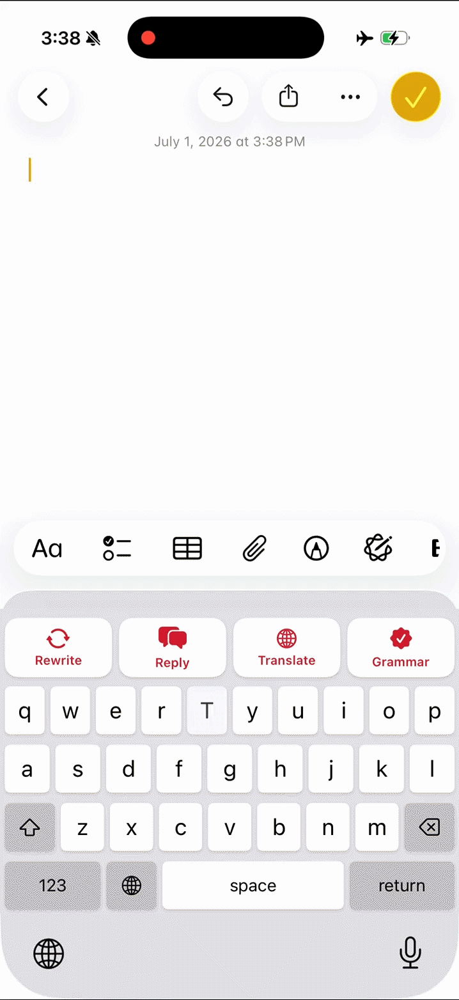

# AI Keyboard (CherryPad)

<div align="center">



</div>

<div align="center">

**On-Device AI Keyboard — Rewrite, Reply, Translate & Grammar, in any app**

[](https://mlange.zetic.ai)
[](Android/)
[](iOS/)

</div>

> [!TIP]
> **View on Melange Dashboard**: [Steve/LFM2.5_350M](https://melange.zetic.ai/p/Steve/LFM2.5_350M) — Contains generated source code & benchmark reports.

**CherryPad** is a custom keyboard that brings AI writing tools into *any* app. Select or type text, then tap one action:

- ✍️ **Rewrite** — restyle your message in a tone (Professional, Casual, Friendly, Romantic)
- 💬 **Reply** — draft a natural reply (Agreeable / Disagreeable)
- 🌐 **Translate** — translate into your chosen language
- ✅ **Grammar** — fix grammar, spelling & punctuation, keeping your tone

Everything runs **on-device** via **Melange** using a small **LFM2.5-350M** (Liquid Foundation Model) instruct model — no network after the first download, and no text ever leaves the device. The model runs **inside the keyboard itself** (iOS keyboard extension / Android IME), so there's no app-switch: tap an action and insert the result right there. iOS is SwiftUI, Android is Jetpack Compose.

## 🚀 Quick Start

1. **Get your Melange API Key** (free): [Sign up here](https://mlange.zetic.ai)
2. **Configure API Key**:
   ```bash
   # From repository root
   ./adapt_mlange_key.sh
   ```
   This replaces the `YOUR_MLANGE_KEY` placeholder in `iOS/CherryPad/Services/ZeticConfig.swift` and
   `Android/app/src/main/java/ai/zetic/demo/cherrypad/llm/ZeticConfig.kt` with your personal access token.
3. **Run the App** (physical device — the model uses the NPU via Melange):
   - **iOS**: generate the project, then open it in Xcode (requires [XcodeGen](https://github.com/yonaskolb/XcodeGen)):
     ```bash
     cd iOS && xcodegen generate && open CherryPad.xcodeproj
     ```
     Run the **`CherryPad`** scheme on a physical iPhone (iOS 17+, arm64). The **`CherryPadPreview`** scheme
     runs a stub engine on the Simulator for UI work.
   - **Android**: open `Android/` in Android Studio and run on a physical device (arm64-v8a, Android 12+).
4. **Enable the keyboard**: add **CherryPad** in the system keyboard settings and grant **Full Access** (iOS) /
   enable the input method (Android) so it can download the model on first use.

> [!NOTE]
> The model runs only on **physical devices** (NPU via Melange). On the **iOS Simulator** the app falls back to a
> built-in stub engine so the UI stays navigable without real inference. First launch downloads the model once;
> after that it runs entirely offline.

## 📚 Resources

- **Melange Dashboard**: [View Model & Reports](https://melange.zetic.ai/p/Steve/LFM2.5_350M)
- **Documentation**: [Melange Docs](https://docs.zetic.ai)
- **Platform deep-dives**: [iOS README](iOS/README.md) · [Android README](Android/README.md)

## 📋 Model Details

- **Model**: LFM2.5-350M (Liquid Foundation Model) — a small, non-reasoning instruct model (~0.3 GB)
- **Task**: Instruction-following for rewrite / reply / translate / grammar (one model, prompt-driven)
- **Runtime**: On-device via Melange, executed **in-process inside the keyboard extension / IME**
