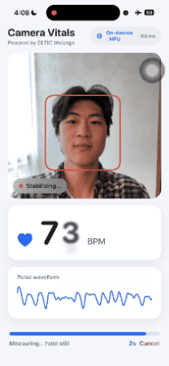

# Camera Vitals

<div align="center">

| **Heart Rate (rPPG)** |
|:---:|
|  |

</div>

<div align="center">

**On-Device Heart-Rate from the Front Camera — Contactless rPPG**

[](https://mlange.zetic.ai)
[](Android/)
[](iOS/)

</div>

> [!TIP]
> **View on Melange Dashboard**: [realtonypark/EfficientPhys-rPPG_camera_vitals](https://mlange.zetic.ai/p/realtonypark/EfficientPhys-rPPG_camera_vitals) — Contains generated source code & benchmark reports.

Camera Vitals measures **heart rate from the front camera, 100% on-device** via ZETIC Melange.
It runs the **EfficientPhys** remote-photoplethysmography (rPPG) model on the device NPU/Neural
Engine: face video → cropped ROI → pulse waveform → bandpass + FFT → BPM, with a signal-quality
badge and smoothing so a noisy window never flashes a wild number. No frames ever leave the
phone — built to show camera-vitals companies they can deploy their own models on-device. iOS is
SwiftUI, Android is Jetpack Compose.

## 🚀 Quick Start

Get up and running in minutes:

1. **Get your Melange API Key** (free): [Sign up here](https://mlange.zetic.ai)
2. **Configure API Key**:
   ```bash
   # From repository root
   ./adapt_mlange_key.sh
   ```
   This replaces the `YOUR_MLANGE_KEY` placeholder in `iOS/CameraVitals/App/AppConfig.swift`
   and `Android/.../cameravitals/AppConfig.kt` with your personal access token.
3. **Run the App**:
   - **Android**: Open `Android/` in Android Studio and run on a physical device (camera + NPU).
   - **iOS**: Generate + open the project under `iOS/`, then run on a physical iPhone (A11+ for
     the Neural Engine) — see the [iOS README](iOS/README.md).

> A **physical device is required** (the simulator/emulator has no real camera and Melange
> targets device NPUs). First launch downloads/compiles the model, then caches it. Measure in
> even light, holding still; expect a ~6 s warm-up. Not a medical device — for demonstration only.

## 📚 Resources

- **Melange Dashboard**: [View Model & Reports](https://mlange.zetic.ai/p/realtonypark/EfficientPhys-rPPG_camera_vitals)
- **Documentation**: [Melange Docs](https://docs.zetic.ai)
- **Platform deep-dives**: [iOS README](iOS/README.md) · [Android README](Android/README.md)

## 📋 Model Details

- **Model**: `realtonypark/EfficientPhys-rPPG_camera_vitals`
- **Task**: Remote photoplethysmography (rPPG) — contactless heart-rate estimation
- **I/O contract**: 31 RGB frames at 72×72 → 30 rPPG pulse samples per inference, stitched into
  a rolling buffer for the heart-rate FFT
- **Key Features**:
  - Fully on-device inference via Melange (Apple Neural Engine / mobile NPU)
  - ~1 Hz inference cadence with a single-flight gate so capture never stalls
  - Spectral-SNR quality gating + median/EMA smoothing for stable BPM

This application showcases the **EfficientPhys** rPPG model using **Melange**, running entirely
locally so no camera frames leave the device. Swapping in a client's own model is a one-line
`AppConfig` change.

## 📁 Directory Structure

```
Camera-Vitals/
├── Android/      # Jetpack Compose implementation with Melange SDK — see Android/README.md
└── iOS/          # SwiftUI implementation (XcodeGen) with Melange SDK — see iOS/README.md
```

For platform-specific pipeline, build, and verification notes, see the
[**iOS README**](iOS/README.md) and [**Android README**](Android/README.md).
