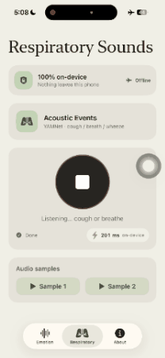
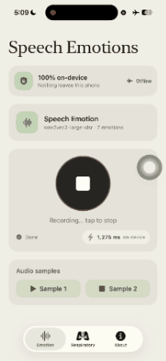

# Voice Biomarker

<div align="center">

| **Emotion** | **Respiratory** |
|:---:|:---:|
|  |  |

</div>

<div align="center">

**On-Device Voice Biomarkers — Speech Emotion + Respiratory Acoustic Events**

[](https://mlange.zetic.ai)
[](Android/)
[](iOS/)

</div>

> [!TIP]
> **View on Melange Dashboard**: Emotion — [realtonypark/Wav2Vec2-Base_Emotion-Recognition](https://mlange.zetic.ai/p/realtonypark/Wav2Vec2-Base_Emotion-Recognition) · Respiratory — [google/Sound Classification (YAMNET)](https://mlange.zetic.ai/p/google/Sound%20Classification(YAMNET)) — Contains generated source code & benchmark reports.

A dual-tab **voice-biomarker** demo that runs speech-AI models **100% on-device** via ZETIC
Melange. The **Emotion** tab runs a wav2vec2 speech-emotion model (prosody, not words) to read
7 emotions as a proxy for vocal mental-health markers; the **Respiratory** tab runs YAMNet
acoustic-event detection to spot cough, breathing, wheeze, sneeze and other respiratory sounds.
Audio is 16 kHz mono in 3-second clips, and the microphone signal never leaves the device — the
HIPAA-friendly pitch. iOS is SwiftUI, Android is Jetpack Compose.

## 🚀 Quick Start

Get up and running in minutes:

1. **Get your Melange API Key** (free): [Sign up here](https://mlange.zetic.ai)
2. **Configure API Key**:
   ```bash
   # From repository root
   ./adapt_mlange_key.sh
   ```
   This replaces the `YOUR_MLANGE_KEY` placeholder in
   `iOS/VoiceVitals/VoiceVitals/Core/AppConfig.swift` and
   `Android/.../voicevitals/core/AppConfig.kt` with your personal access token.
3. **Run the App**:
   - **Android**: Open `Android/` in Android Studio and run on a physical device (arm64).
   - **iOS**: Open `iOS/` in Xcode and run on a physical iPhone (microphone + NPU).

> Both models run **only on physical devices** (Melange ships device-only slices). The first
> launch downloads/compiles the models; afterwards they're cached and run offline.

## 📚 Resources

- **Melange Dashboard**: [Emotion model](https://mlange.zetic.ai/p/realtonypark/Wav2Vec2-Base_Emotion-Recognition) · [Respiratory model (YAMNet)](https://mlange.zetic.ai/p/google/Sound%20Classification(YAMNET))
- **Documentation**: [Melange Docs](https://docs.zetic.ai)
- **Platform deep-dives**: [iOS README](iOS/VoiceVitals/README.md) · [Android offline note](Android/OFFLINE_NOTE.md)

## 📋 Model Details

- **Emotion** — `realtonypark/Wav2Vec2-Base_Emotion-Recognition` (v2)
  - 7-class wav2vec2 speech-emotion recognition (angry, disgust, fear, happy, neutral, sad,
    surprise). Reads prosody — pitch, energy, rate, voice quality — not word meaning.
- **Respiratory** — `google/Sound Classification (YAMNET)` (v1)
  - AudioSet acoustic-event detection; surfaces cough, breathing, wheeze, sneeze, throat
    clearing, sniff, gasp, snore and related respiratory sounds.
- **Task**: On-device voice biomarkers — vocal emotion + respiratory acoustic events
- **Audio**: 16 kHz mono, 3-second clips, fully on-device

Both models are already hosted on Melange — no upload step. Swapping in a client's own model is
a one-line `AppConfig` change. This application showcases on-device audio inference via
**Melange**, NPU-accelerated and running entirely locally.

## 📁 Directory Structure

```
Voice-Biomarker/
├── Android/      # Jetpack Compose implementation with Melange SDK (see Android/OFFLINE_NOTE.md)
└── iOS/          # SwiftUI implementation with Melange SDK (see iOS/VoiceVitals/README.md)
```

For platform-specific architecture and offline-behavior notes, see the
[**iOS README**](iOS/VoiceVitals/README.md) and the [**Android offline note**](Android/OFFLINE_NOTE.md).
