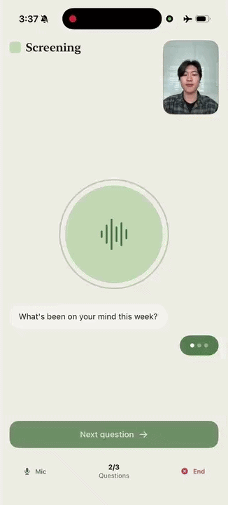

# Conversational Multimodal Screener

<div align="center">

| **Berry Check-in** |
|:---:|
|  |

</div>

<div align="center">

**Guided, On-Device Multimodal Mood Check-in — Face + Voice Emotion, Fused Locally**

[](https://mlange.zetic.ai)
[](Android/)
[](iOS/)

</div>

> [!TIP]
> **View on Melange Dashboard**: Voice — [realtonypark/Wav2Vec2-Base_Emotion-Recognition](https://mlange.zetic.ai/p/realtonypark/Wav2Vec2-Base_Emotion-Recognition) · Face — [ElenaRyumina/FaceEmotionRecognition](https://mlange.zetic.ai/p/ElenaRyumina/FaceEmotionRecognition) — Contains generated source code & benchmark reports.

A guided, **conversational multimodal screener** that runs **100% on-device** via Melange.
An emoting "Berry" avatar asks a few open-ended questions while your **facial expression**
(Melange FER) and **voice** (Melange wav2vec2 SER) are read locally and **late-fused** into
an explainable, *non-diagnostic* "Screening Insights" readout — Mood, Energy, and Rate of
Speech rolled into a composite well-being score. Camera frames and microphone audio never
leave the phone — the HIPAA-friendly pitch. iOS is SwiftUI, Android is Jetpack Compose.

## 🚀 Quick Start

Get up and running in minutes:

1. **Get your Melange API Key** (free): [Sign up here](https://mlange.zetic.ai)
2. **Configure API Key**:
   ```bash
   # From repository root
   ./adapt_mlange_key.sh
   ```
   This replaces the `YOUR_MLANGE_KEY` placeholder in `iOS/Aiberry/Core/AppConfig.swift`
   and `Android/.../core/AppConfig.kt` with your personal access token.
3. **Run the App**:
   - **Android**: Open `Android/` in Android Studio and run on a physical device (arm64, minSdk 31).
   - **iOS**: Open `iOS/` in Xcode and run on a physical iPhone (camera + mic + NPU).

> Both models run **only on physical devices** (Melange ships device-only slices). The first
> launch needs network for the backend handshake and model download; after that the models are
> cached and the app runs offline — verify with Airplane Mode.

## 📚 Resources

- **Melange Dashboard**: [Voice model](https://mlange.zetic.ai/p/realtonypark/Wav2Vec2-Base_Emotion-Recognition) · [Face model](https://mlange.zetic.ai/p/ElenaRyumina/FaceEmotionRecognition)
- **Documentation**: [Melange Docs](https://docs.zetic.ai)
- **Platform deep-dives**: [iOS README](iOS/README.md) · [Android README](Android/README.md)

## 📋 Model Details

- **Voice emotion** — `realtonypark/Wav2Vec2-Base_Emotion-Recognition` (v2)
  - 7-class wav2vec2 speech-emotion recognition over 3-second, 16 kHz audio clips.
- **Face emotion** — `ElenaRyumina/FaceEmotionRecognition` (v1)
  - ResNet50/AffectNet facial-expression recognition; faces are found/cropped on-device by
    Apple **Vision** (iOS) / **ML Kit** (Android), then run at ~3 Hz.
- **Task**: Multimodal emotion → late-fused, explainable well-being readout
- **Fusion**: A transparent valence/arousal rule (Russell circumplex), **not** a trained head
  — Mood, Energy, and Rate of Speech combine into a composite well-being score. The iOS and
  Android formulas are byte-for-byte identical.

Both models are already hosted on Melange — no upload step. Swapping in a client's own model
is a one-line `AppConfig` change. This application showcases multimodal on-device inference via
**Melange**, with all capture, inference, and fusion running locally.

## 📁 Directory Structure

```
multimodal-screener/
├── Android/      # Jetpack Compose implementation with Melange SDK — see Android/README.md
└── iOS/          # SwiftUI implementation with Melange SDK — see iOS/README.md
```

For platform-specific architecture notes (model I/O contracts, threading model, mock vs. real
engine, permissions, build flags), see the detailed [**iOS README**](iOS/README.md) and
[**Android README**](Android/README.md).
