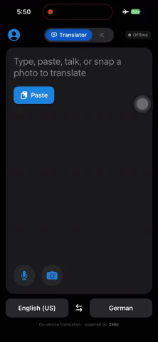

# Offline Translator (HY-MT)

<div align="center">

| **Text** | **Voice** | **Visual / OCR** |
|:---:|:---:|:---:|
|  |  |  |

</div>

<div align="center">

**Fully Offline Text, Voice & Visual Translation for 40+ Languages**

[](https://mlange.zetic.ai)
[](Android/)
[](iOS/)

</div>

> [!TIP]
> **View on Melange Dashboard**: [vaibhav-zetic/tencent_HY-MT](https://mlange.zetic.ai/p/vaibhav-zetic/tencent_HY-MT?tab=summary) - Contains generated source code & benchmark reports.

This is the upgraded successor to [**Tencent HY-MT**](../tencent_HY-MT) — a DeepL-style translator that runs the
**Tencent HY-MT (Hunyuan-MT)** model **fully on-device / offline** via Melange, and adds **voice** and **visual
(OCR)** input on top of text translation. iOS is SwiftUI, Android is Jetpack Compose.

## 🚀 Quick Start

Get up and running in minutes:

1. **Get your Melange API Key** (free): [Sign up here](https://mlange.zetic.ai)
2. **Configure API Key**:
   ```bash
   # From repository root
   ./adapt_mlange_key.sh
   ```
3. **Run the App**:
   - **Android**: Open `Android/` in Android Studio and run on a physical device (arm64-v8a, Android 12+).
   - **iOS**: Generate the project, then open it in Xcode (requires [XcodeGen](https://github.com/yonsm/XcodeGen)):
     ```bash
     cd iOS && xcodegen generate && open OfflineTranslator.xcodeproj
     ```
     Pick the **`OfflineTranslator`** scheme for real offline translation on a physical iPhone (iOS 16.6+, arm64).
     The **`OfflineTranslatorPreview`** scheme runs a mock engine on the iOS Simulator for UI work.

> First launch downloads the model once; after that the app runs entirely offline — verify by switching the
> device to **Airplane Mode** and translating.

## 📚 Resources

- **Melange Dashboard**: [View Model & Reports](https://mlange.zetic.ai/p/vaibhav-zetic/tencent_HY-MT?from=use-cases)
- **Use Cases**: [Tencent HY-MT on Use Cases Page](https://mlange.zetic.ai/use-cases) → [Direct Link](https://mlange.zetic.ai/p/vaibhav-zetic/tencent_HY-MT?from=use-cases)
- **Documentation**: [Melange Docs](https://docs.zetic.ai)
- **Platform deep-dives**: [iOS README](iOS/README.md) · [Android README](Android/README.md)

## 📋 Model Details

- **Model**: Tencent HY-MT (Hybrid / Hunyuan Machine Translation)
- **Task**: Machine Translation
- **Melange Project**: [vaibhav-zetic/tencent_HY-MT](https://mlange.zetic.ai/p/vaibhav-zetic/tencent_HY-MT?from=use-cases)
- **Supported Languages**: **40+ languages** with comprehensive coverage
- **Key Features**:
  - **Text translation** with real-time streaming output and instant source ⇄ target language swapping
  - **Voice input** (offline speech-to-text) — Apple **Speech** framework on iOS, **ML Kit GenAI** on Android
  - **Visual / OCR input** (offline) — Apple **Vision** on iOS, **ML Kit Text Recognition** on Android, from camera or photo library
  - **Text-to-speech** read-out, copy & share — all on-device
  - NPU-optimized via Melange; runs fully offline after the first model download

This application showcases the **Tencent HY-MT** model using **Melange**. HY-MT is a hybrid machine translation
model that provides high-quality translations across 40+ languages, optimized for on-device inference with NPU
acceleration. On top of typed text, this app adds on-device **voice** and **visual (OCR)** capture so you can
translate speech and printed text without any network connection.

### 🌍 Comprehensive Language Support

One of the key advantages of Tencent HY-MT is its extensive language coverage. The model supports **40+ languages**,
making it ideal for global applications that need to serve diverse user bases.

**Supported Languages (40 languages):**

| **Language** | **Language** | **Language** | **Language** |
|:---:|:---:|:---:|:---:|
| Chinese | English | French | Portuguese |
| Spanish | Japanese | Turkish | Russian |
| Arabic | Korean | Thai | Italian |
| German | Vietnamese | Malay | Indonesian |
| Filipino | Hindi | Traditional Chinese | Polish |
| Czech | Dutch | Khmer | Burmese |
| Persian | Gujarati | Urdu | Telugu |
| Marathi | Hebrew | Bengali | Tamil |
| Ukrainian | Tibetan | Kazakh | Mongolian |
| Uyghur | Cantonese | | |
||

## 📁 Directory Structure

```
translate-tencent_HY-MT/
├── Android/      # Android implementation (Jetpack Compose) — see Android/README.md
├── iOS/          # iOS implementation (SwiftUI, XcodeGen) — see iOS/README.md
└── gguf/         # llama.cpp / model-prep tooling
```

For platform-specific architecture notes (threading model, mock vs. real engine, permissions, build flags), see
the detailed [**iOS README**](iOS/README.md) and [**Android README**](Android/README.md).
